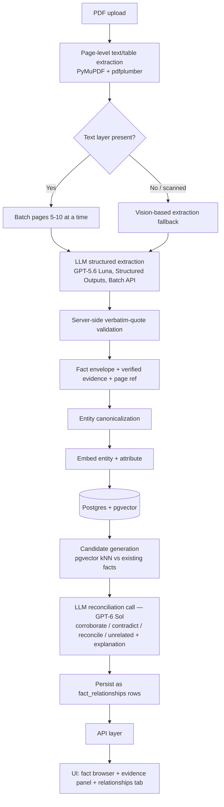

# Technical Requirements Document
## Fact Knowledge Layer — System Architecture & Design

Companion to `00-strategy-overview.md` (rationale/prioritization) and `01-PRD.md` (requirements). This document specifies *how* to build it.

---

## 1. Architecture Overview



Everything left of the vector store is **per-document and stateless** with respect to the rest of the corpus — this is what makes incremental ingestion (brownie point 4) free. Everything right of it (candidate generation onward) is the only part that touches existing data, and it touches it via an index lookup, not a full scan — this is what makes "many PDFs" (brownie point 2) tractable.

---

## 2. Data Flow, Stage by Stage

### 2.1 Extraction (per page-batch, fully parallelizable across batches and across documents)
Input: 5–10 pages of raw text (+ any tables `pdfplumber` recovered as structured cell grids).
Output: a list of `Fact` objects (schema in §3), each carrying its own evidence.

Use OpenAI **Structured Outputs** (JSON-schema strict mode) for the `Fact` shape, submitted via the **Batch API**. Model choice: **GPT-5.6 Luna** for this stage (cheap, fast, good at structured extraction over well-formed input, $0.20/$1.20 per MTok standard, effectively ~$0.10/$0.60 batched); escalate a page-batch to **GPT-5.6 Terra** automatically if Luna returns zero facts from a page that clearly contains dense tabular data (a cheap heuristic: page has >N numeric tokens but 0 extracted facts → retry with the stronger model).

**Evidence grounding without native citations.** Unlike Claude, OpenAI's API does not return an automatic `cited_text` span tied to source location — this has to be built explicitly:
1. The `Fact` JSON schema includes a `verbatim_quote` field, with the prompt instructing the model to copy the exact source text, not paraphrase.
2. **Server-side validation**: normalize whitespace on both `verbatim_quote` and the raw page text extracted by `pdfplumber`/`PyMuPDF` (not the model's own text), and confirm the quote is an actual substring. On failure, retry the extraction call once; if it fails twice, persist the fact with `evidence_confidence: low` rather than dropping it or asserting it as grounded.
3. This validator doubles as a legitimate, demonstrable source for the required extraction-failure case (FR-17) — log every quote-validation failure with the raw model output alongside it.

### 2.2 Entity canonicalization
Cheap, deterministic pass first (normalize whitespace/casing, strip legal suffixes like "Limited"/"Ltd."), then an embedding-similarity pass against existing canonical entities: if a new entity string embeds within a similarity threshold of an existing entity, merge; otherwise register a new canonical entity. Keep an `aliases[]` list per entity so "Delhivery," "Delhivery Limited," and "the Company" (where context makes the referent unambiguous) all resolve to one node — this directly targets the brief's own example of "differently written addresses may refer to the same place."

### 2.3 Dynamic fact-type registry (brownie point: schema evolution)
A single table: `fact_types(id, label, description, embedding, example_qualifiers_schema, created_at)`.

On each new fact, embed `fact_type` (as proposed by the extraction model, e.g., `"financial_metric"`, `"director_appointment"`, `"registered_address"`, `"macro_indicator"`) and compare against existing rows:

- **Match found** (cosine similarity above threshold, e.g., 0.85) → reuse existing `fact_type_id`.
- **No match** → insert a new row. Optionally run one extra LLM call to induce a light JSON-schema for that type's expected `qualifiers` shape (e.g., a `macro_indicator` type learns it typically has `qualifiers.reporting_agency` and `qualifiers.estimate_type: provisional|revised`), so future facts of that type get soft-validated rather than freely-shaped. This is schema evolution **as data**, not as a migration.

### 2.4 Candidate generation for reconciliation
For a new (or newly re-embedded) fact: query the vector index for the top-K nearest facts *among existing facts with the same canonical entity* (entity match is a hard filter; embedding similarity ranks within it). This turns "compare against everything" into "compare against ~5–20 plausible matches." Only these pairs go to the reconciliation LLM call.

### 2.5 Reconciliation
A single structured LLM call per candidate pair, given both facts *and* both evidence quotes, asked to return:

```json
{
  "relationship": "corroborates | contradicts | reconciled_by_context | unrelated",
  "confidence": 0.0-1.0,
  "reconciliation_basis": "time_period | scope | units | rounding | restatement | none",
  "explanation": "one or two sentences a human can audit"
}
```

Model choice: **GPT-6 Sol** — this call requires genuine judgment (is a ₹6,300 Cr vs ₹7,225 Cr difference a contradiction or a standalone-vs-consolidated distinction?), not just extraction, and it's worth using the strongest currently-available model since this is deliberately the most expensive call in the pipeline and the fewest in number — candidate generation (§2.4) already filtered out the vast majority of irrelevant pairs, so the per-call cost of the best model doesn't blow up the total.

---

## 3. Storage Layer

### 3.1 Decided: Postgres (Supabase) + `pgvector` — the only store

Given the build-time constraint, this is the primary and only planned store, not a fallback (see `00-strategy-overview.md` §3.2 for the full trade-off reasoning). All four required cases are 1-hop fact-to-fact relationships, so Neo4j's multi-hop traversal advantage isn't exercised by anything this submission needs to demonstrate, and Postgres is the tool already proven out on Ledgerd.

**Tables:**
```sql
documents(id, title, doc_type, publisher, as_of_date, source_uri, content_hash)
entities(id, canonical_name, aliases text[])
fact_types(id, label, description, embedding vector(1536), example_qualifiers_schema jsonb)
facts(id, document_id references documents, entity_id references entities,
      fact_type_id references fact_types, attribute, value, value_type,
      unit, period_start, period_end, as_of_date, qualifiers jsonb,
      verbatim_quote, page_number, evidence_confidence, embedding vector(1536))
fact_relationships(id, fact_a_id references facts, fact_b_id references facts,
                    relationship,  -- 'corroborates'|'contradicts'|'reconciled_by_context'|'unrelated'
                    basis,         -- 'time_period'|'scope'|'units'|'rounding'|'restatement'|'none'
                    explanation, confidence, created_at)
```
An HNSW index on `facts.embedding` (`CREATE INDEX ... USING hnsw (embedding vector_cosine_ops)`) covers candidate generation (§2.4); `fact_relationships` is the "graph" — a two-column adjacency structure is all four required cases actually need, and `SELECT * FROM fact_relationships WHERE fact_a_id = X` is the equivalent of the one-hop Cypher query this problem calls for. Supabase free tier: 500 MB DB, comfortably enough for a few thousand facts + embeddings; pauses after 7 days idle (non-issue while actively building).

### 3.2 Optional stretch, not on the critical path: Neo4j read-sync for visualization
If the core system (§2.1–2.5, §3.1) is fully working with time to spare, a one-way sync job that mirrors `facts`/`fact_relationships` into Neo4j AuraDB Free purely to power a graph visualization is a reasonable brownie-point add. It must stay strictly read-through/derived — Postgres remains the source of truth — so a Neo4j outage or a broken sync job never blocks fact extraction, evidence lookup, or reconciliation. Do not start this before Phase 2 (§8) is done.

### 3.3 Original PDF storage (for evidence rendering)
Store the raw uploaded PDF bytes in **Cloudflare R2** (10 GB free, zero egress fees, no time-based expiry — the most durable free option here, since Render's own disk is ephemeral and wiped on redeploy/sleep). The evidence panel in the UI can then render "page 42 of the original PDF, quote highlighted" by fetching the page from R2 rather than trusting the extracted text alone.

---

## 4. API Design

| Endpoint | Method | Purpose |
|---|---|---|
| `/documents` | `POST` | Upload a PDF (multipart). Returns `{doc_id, status: "processing"}` immediately (202). |
| `/documents/{id}` | `GET` | Status + metadata (title, page count, doc_type as inferred, ingestion progress). |
| `/documents/{id}/facts` | `GET` | All facts extracted from this document, each with its evidence. |
| `/facts/{id}` | `GET` | One fact in full, including all evidence and all outgoing relationship edges with explanations. |
| `/facts/{id}/relationships` | `GET` | Just the corroborate/contradict/reconcile edges for this fact, with explanations — this is the endpoint the demo video leans on. |
| `/entities/{id}` | `GET` | Canonical entity + every fact referencing it, across every document. |
| `/entities/{id}/aliases` | `GET` | How the entity resolution merged different surface forms — useful for showing your reasoning, not just the result. |
| `/search?q=` | `GET` | (Nice-to-have) semantic search over facts by free text. |
| `/health` | `GET` | For your own keep-alive ping and for the evaluator's sanity check. |

Auto-generate OpenAPI docs (`/docs` via FastAPI) — this satisfies "provide a simple API... through which we can upload PDFs and inspect the results" with no extra UI work required for the API half of that requirement.

---

## 5. Handling the Four Required Cases in This Dataset
Concrete starting points for where to look, given the actual starter PDFs (validate against your own extraction, don't hard-code these — but they're reasonable places to point your pipeline first):

- **Corroboration**: a headline figure (revenue, delivery volume, PIN codes served) stated in the FY24 Annual Report's MD&A section and restated consistent with the same period in the Q4 FY24 earnings deck — same underlying figure, two different disclosure formats. This is exactly the brief's own "expressed differently" example.
- **Genuine/likely contradiction**: board composition or a named director's status — the Prospectus (2022) board section vs. the FY24 Annual Report's corporate governance section is precisely the brief's own worked example ("a director may appear active in one document and resigned in a later one").
- **Reconciled by context**: a financial metric that differs between the Prospectus (2022, pre-IPO figures, possibly a different fiscal year and standalone/consolidated basis) and the FY24 Annual Report, reconciled once your system surfaces the differing fiscal year or consolidation basis as `reconciliation_basis`. The macro-economy dataset is an even richer source for this: GDP growth or inflation figures for the same period are commonly reported as *provisional* by one publisher and *revised* by another (Economic Survey vs. RBI Annual Report vs. IMF Article IV all publish overlapping macro series on different vintages/revision cycles) — a strong, defensible "apparent contradiction, explained by context" case.
- **Failure case**: the honest candidates to look for are (a) a footnote reference number or table-of-contents page number mis-read as a data value, (b) a unit confusion (₹ crore vs. ₹ lakh vs. ₹ million) that your reconciliation step should ideally catch as a `units` basis but might instead flag as a false contradiction, or (c) a merged/nested table cell (common in the financial-statements sections of both PDFs) that the table extractor mis-aligns. Document whichever one you actually hit — this is a required, graded deliverable, not an optional confession.

---

## 6. Deployment Blueprint (Free Tier, Verified Current)

| Component | Target | Verified free-tier ceiling | Known caveat |
|---|---|---|---|
| Backend API + worker | Render (free web service) | 750 hrs/month compute | **Sleeps after 15 min inactivity**, ~30–60s cold-start on wake |
| Fact store + vector index | Supabase (Postgres + pgvector) | 500 MB DB, 1 GB file storage | Project **pauses after 7 days** inactivity |
| *(optional stretch)* Graph visualization mirror | Neo4j AuraDB Free | 200K nodes / 400K relationships | Read-through sync only, never source of truth — see TRD §3.2 |
| PDF/object storage | Cloudflare R2 | 10 GB storage, free egress | Free tier applies to Standard storage only |
| Frontend | Vercel Hobby | 100 GB bandwidth, ~1M function invocations/month | Serverless function timeout is short (10–60s depending on plan detail) — never run extraction *inside* a Vercel function; it only talks to the Render backend |
| LLM | OpenAI API | Pay-as-you-go, not free, but cheap at this scale (see §7) | GPT-5.6 Luna (batch) for extraction, GPT-6 Sol for reconciliation |

**Mitigating the sleep/pause problem for your demo:** either (a) schedule a low-frequency (e.g., every 10 minutes, only around when you expect review) keep-alive ping from a free cron service, or (b) simply say so in the README ("first request after inactivity may take up to a minute to wake the free-tier services") — this is honest and matches the brief's own "be honest about what works and what does not" instruction. Don't build elaborate keep-alive infrastructure purely to hide a free-tier characteristic that's normal and expected.

---

## 7. Cost Estimate
Processing all three starter PDFs (~205 pages combined) with **GPT-5.6 Luna in Batch mode** for extraction (~$0.10/$0.60 per MTok in/out batched) and **GPT-6 Sol** at standard rate ($4/$20 per MTok) for reconciliation calls on a few hundred candidate pairs comes in at roughly **$2-3 total** for a full corpus pass, and a handful of dollars with iteration and re-runs during development. Cost is not the constraint on this project — extraction and reasoning quality, and the honesty of the quote-validation step, are.

---

## 8. Build Order (mirrors `00-strategy-overview.md` §6, technical detail)
1. Single-page structured extraction + citations round-trip, verified manually against the source PDF (no infra yet).
2. Page-batch extraction across one full document → Postgres (simplest possible store) → `/documents/{id}/facts` endpoint returning facts with evidence.
3. Entity canonicalization + embeddings + candidate generation + reconciliation call, run across both starter datasets — this is where the four required cases get found.
4. Swap/extend storage to Neo4j AuraDB; add the fact-type registry (§3.3/§2.3) so schema evolution is demonstrable, not just theoretical.
5. Async ingestion (background task or real queue), R2 for original PDFs, deployment to the free-tier targets above.
6. UI: fact browser, evidence panel, relationships tab. Script and record the 3-minute demo around the four required cases specifically.
